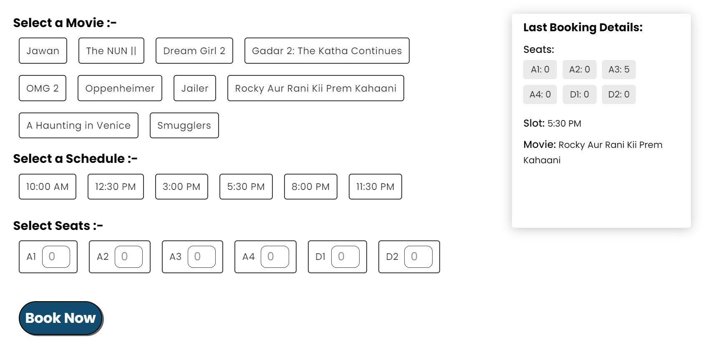

# This is a Full-Stack-Project 
 Author - Mehul Yadav

# Book My Show

<h3 align="center">
  Book My Show Website preview  
  
</h3>

 
<h5>This is a Ticket Booking website where the user can book a movie ticket with specified seats at a specified slot and get a confirmation that, whether booking was successful or not.

The movie booked by the user will be stored in database and is retrived and shown to the user.</h5>

## 📖 Website's Live URL  
  [https://mehultech1995.github.io/BookMyShow/ ](https://mehultech1995.github.io/BookMyShow-FrontEnd/) 
  (or you can just click on above image will redirect you to the website)

## ⭐ Technologies that are used.

### FrontEnd
- #### React  
    This app is fully built on top of react library.
- #### Axios / Fetch
    Used for making api calls.
- #### Context API
    for managing states and props.
- #### var()
    for global color.
- #### React-Toastify
    for showing Success alert on booking sucessfully  and error alert for any error to user.

## To open the app in your loacl browser.

Open [http://localhost:3000]to view the website in your local browser.

## 🛠 Installation and Setup Instructions

1. Installation: `npm install`

2. In the project directory, you can run: `npm start`

##
<h4 align="center">Made by Mehul</h4>
<h4 align="center">Thank You</h4>

